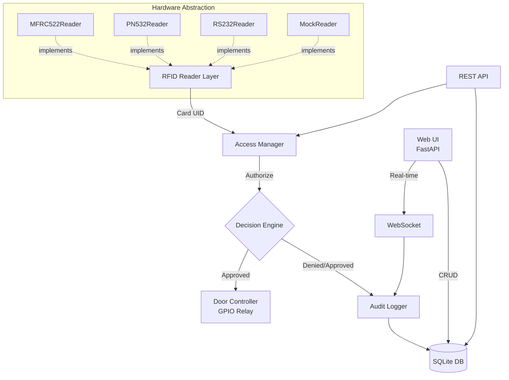

# RPi RFID Access Control

> Production-grade single-door access control system for Raspberry Pi.
> Built with industry best practices learned from managing distributed multi-door deployments.

[](https://opensource.org/licenses/Apache-2.0)
[](https://www.python.org/)
[](https://fastapi.tiangolo.com/)
[](https://github.com/btankutt/rpi-rfid-access-control/actions)

🇹🇷 [Türkçe README](README.tr.md)

---

## Overview

A complete, self-contained RFID-based access control solution for single-door deployments. Designed to be production-ready out of the box: tamper-resistant, network-resilient, and operable without continuous internet connectivity.

This project is built by an engineer with **5+ years of experience** operating a 25-door distributed RFID access control system. The patterns and trade-offs reflected here are drawn from real-world production deployments, not tutorial code.

---

## Key Features

### Hardware Support
- **Three RFID reader types** supported out of the box:
  - MFRC522 (SPI, hobby-grade module)
  - PN532 (NFC-capable, supports cryptographic authentication)
  - Industrial RS-232 readers (Wiegand-to-serial bridges)
- **Mock hardware mode** for development without physical devices
- **GPIO relay control** for electromagnetic lock actuation
- **Optional peripherals**: LED status indicator, buzzer for audio feedback, LCD display

### Software
- **Authorization engine**: role-based access (admin / operator / user), time-window restrictions, expirable cards
- **Persistent storage**: SQLite with automatic backup
- **Full audit log**: every read attempt logged with metadata (timestamp, card UID, decision, reason)
- **Web management UI** (FastAPI): user CRUD, log viewer, system health
- **REST API**: programmatic integration with external systems
- **Authentication**: bcrypt-hashed admin credentials, session-based UI auth
- **Real-time updates**: WebSocket support for live event streaming

### Production Readiness
- **Fail-safe / fail-secure** modes for power outage handling
- **Tamper detection** via optional door switch sensor
- **Network resilience**: offline-first, syncs when connectivity returns
- **Health monitoring**: heartbeat endpoint, systemd watchdog integration
- **Docker support** for reproducible deployments
- **CI/CD**: GitHub Actions runs tests on every push
- **Test coverage**: pytest with 90%+ coverage target

---

## Quick Start (5 minutes, no hardware required)

```bash
# 1. Clone
git clone https://github.com/btankutt/rpi-rfid-access-control.git
cd rpi-rfid-access-control

# 2. Install dependencies
python -m venv venv
source venv/bin/activate  # Windows: venv\Scripts\activate
pip install -r requirements.txt

# 3. Configure for mock mode
cp .env.example .env
# Edit .env — set USE_MOCK_HARDWARE=true

# 4. Run
python -m src.main

# 5. Open browser
# Web UI:  http://localhost:8000
# API docs: http://localhost:8000/docs
```

The system will start in **mock mode** — no Raspberry Pi or RFID hardware needed. Use the web UI's "Simulate Card Read" button to test the flow end-to-end.

### One-shot smoke test (no server)

For CI pipelines or quick sanity checks you can run a single authorization
decision without spinning up the HTTP server:

```bash
python -m src.main --simulate-card A1B2C3D4
# {"granted": false, "reason": "UNKNOWN_CARD", "user_id": null}
# Exit code: 1 (DENIED). Exit 0 means GRANTED.
```

---

## Architecture



See [docs/architecture.md](docs/architecture.md) for detailed component documentation.

---

## Hardware Setup

Minimum bill of materials:

| Component | Notes |
|-----------|-------|
| Raspberry Pi Zero 2 W (or Pi 3/4) | Pi 4 recommended for production |
| MicroSD card | 16 GB minimum, Class 10 |
| Power adapter | 5V, 2.5A or higher |
| MFRC522 RFID module | SPI; 3.3V only — do not power from 5V |
| 1-channel relay module | Opto-isolated recommended for AC loads |
| RFID cards/tags | MIFARE Classic 1K compatible |
| Jumper wires | Female-to-female for Pi GPIO |
| **Optional:** 12V solenoid/electromagnetic lock | Fail-safe (NO) or fail-secure (NC) per requirements |
| **Optional:** LED, buzzer | Visual/audio feedback |

For production deployments with industrial-grade RS-232 readers (HID, Wiegand), see [docs/hardware-setup.md](docs/hardware-setup.md).

---

## Configuration

All configuration is done via environment variables (`.env` file):

```env
# Hardware
USE_MOCK_HARDWARE=true              # false on production Pi
READER_TYPE=mfrc522                 # mfrc522 | pn532 | rs232 | mock
RELAY_GPIO_PIN=17
DOOR_SWITCH_GPIO_PIN=18             # optional tamper sensor

# Database
DATABASE_PATH=./data/access.db
BACKUP_INTERVAL_HOURS=24

# Web
WEB_HOST=0.0.0.0
WEB_PORT=8000
ADMIN_USERNAME=admin
ADMIN_PASSWORD_HASH=...             # bcrypt hash, see scripts/hash_password.py

# Security
DOOR_OPEN_DURATION_SECONDS=5
FAIL_SAFE_MODE=true                 # true: door opens on power loss
RATE_LIMIT_FAILED_ATTEMPTS=5        # lockout after N failures

# Logging
LOG_LEVEL=INFO
LOG_FILE=./logs/access.log
```

---

## Production Considerations

Based on real-world deployments, here are non-obvious gotchas:

- **SPI signal stability**: MFRC522 traces should be < 30 cm to avoid noise. For longer runs, use shielded cable or switch to RS-485.
- **Relay isolation**: Always use opto-isolated relay modules for AC loads. Cheap modules can backfeed into the Pi's GPIO.
- **Power architecture**: Pi and lock should be on **separate power rails**. Inrush from the lock can crash the Pi.
- **Fail-safe vs fail-secure**: Configure based on regulation. Building codes often require **fail-safe** (door opens on power loss) for egress, but **fail-secure** for entry-only doors.
- **Network resilience**: Never assume cloud connectivity. The system must function offline; sync is a secondary feature.
- **Tamper detection**: A door switch sensor detects forced entry. Pair with the audit log for security audits.
- **Card cloning**: MFRC522 reads UID only — UID can be cloned. For high-security, use PN532 with cryptographic authentication (DESFire EV1+).
- **Backup strategy**: SQLite is rock-solid but backups must be **off-device** (rsync to NAS, etc.). On-device backups don't protect against SD card failure.

---

## Roadmap

- [ ] LDAP / Active Directory integration
- [ ] Multi-door coordination protocol (companion repo: `multi-pi-fleet-manager`)
- [ ] Mobile app (React Native) for admin tasks
- [ ] OSDP protocol support (industrial standard)
- [ ] Time-attendance reporting module

---

## License

Apache License 2.0 — see [LICENSE](LICENSE) file.

This is permissive open-source: you may use, modify, and distribute this software (including commercially), provided you retain the copyright notice and disclose any modifications to the patent grant.

---

## Author

**Barış Tankut** — Embedded Systems & Algorithmic Trading Developer
12+ years of professional experience in software & hardware integration.
5+ years specializing in distributed IoT access control systems.

- GitHub: [@btankutt](https://github.com/btankutt)
- Open to consulting & freelance work in IoT, embedded systems, and trading systems

---

## Contributing

Pull requests are welcome. For major changes, please open an issue first to discuss what you'd like to change.

Please ensure tests pass and add new tests for any new functionality.

```bash
pytest --cov=src tests/
```
