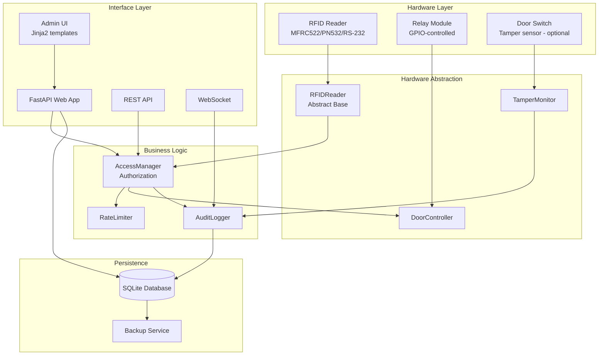
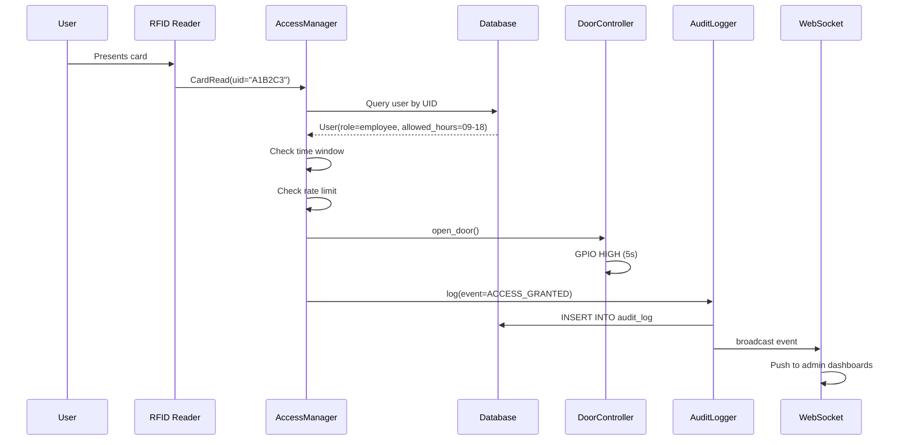
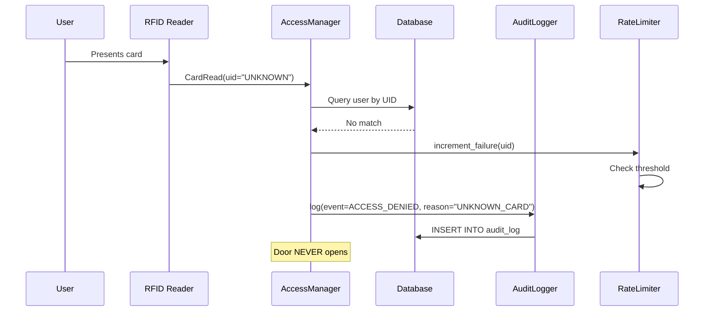

# Architecture

This document describes the internal architecture of the RPi RFID Access Control system.

## High-Level Component Diagram

## Component Responsibilities

### Hardware Layer

The lowest layer interacts directly with physical devices via GPIO, SPI, I2C, or UART. This layer is the only part of the system that requires actual Raspberry Pi hardware.

### Hardware Abstraction Layer

This layer provides clean, async Python interfaces over the hardware. Critically, every hardware component has a **mock implementation** that allows the entire system to run on any computer for development and testing.

- **`RFIDReader`** — Abstract base for card readers. Implementations: `MFRC522Reader`, `PN532Reader`, `RS232Reader`, `MockRFIDReader`.
- **`DoorController`** — Controls the relay that drives the electromagnetic lock. Handles fail-safe vs fail-secure policy.
- **`TamperMonitor`** — Watches an optional door switch for forced entry detection.

### Business Logic

The "brain" of the system. Stateless decision-making based on data from the persistence layer.

- **`AccessManager`** — Receives card reads, queries the user database, checks time-window and role permissions, decides allow/deny, and triggers the door controller.
- **`AuditLogger`** — Writes every event (read attempt, decision, tamper event) to the database. Never blocks the access decision.
- **`RateLimiter`** — Prevents brute-force attacks by locking out a reader after N consecutive failed reads.

### Persistence

- **SQLite** — Single-file database, perfect for embedded deployments. No separate database server required.
- **Backup Service** — Periodic SQLite dumps for off-device retention.

### Interface Layer

- **FastAPI** — Modern async web framework. Hosts:
  - Admin UI (Jinja2-rendered HTML for user management, log viewing, system health)
  - REST API (JSON endpoints for programmatic integration)
  - WebSocket (real-time event streaming to admin dashboard)

## Data Flow: A Successful Card Read

## Data Flow: A Denied Card Read

## Concurrency Model

The system uses Python `asyncio` throughout. Key patterns:

1. **Reader loop**: An infinite async loop polls the RFID reader. Each card read spawns a task to handle authorization without blocking the read loop.

2. **Web requests**: FastAPI handles HTTP requests in an event loop. Database queries use `aiosqlite` to avoid blocking.

3. **Hardware operations**: Synchronous libraries (`mfrc522`, `pyserial`) are wrapped in `loop.run_in_executor()` to prevent blocking the event loop.

## Why FastAPI?

- **Async-first**: Aligns with the rest of the stack
- **Auto-generated OpenAPI docs** at `/docs` — useful for developers integrating with the system
- **Pydantic models**: Type-safe request/response validation
- **WebSocket support built-in**: Real-time admin dashboards
- **Production-ready**: Used by Uber, Netflix, Microsoft

## Why SQLite (not Postgres)?

For single-door deployments, SQLite is the right choice:

- **Zero administration**: No database server to manage
- **File-based**: Easy backup (copy the file)
- **Fast for read-heavy workloads**: This system reads users far more than it writes audit logs
- **ACID-compliant**: Reliable for critical security data
- **Embedded-friendly**: Runs on a Raspberry Pi Zero with minimal overhead

For multi-door fleet deployments (see `multi-pi-fleet-manager`), each node runs SQLite locally and syncs to a central Postgres for aggregated reporting.

## Security Considerations

- **Card UID is not a secret**: MFRC522 reads UID only — this can be cloned. For high-security applications, use PN532 with DESFire EV1+ authenticated reads.
- **Web admin password**: Stored as bcrypt hash, never plaintext.
- **Session security**: Random 32+ character secret, secure cookies, CSRF protection.
- **Rate limiting**: Prevents brute-force card scanning attacks.
- **Tamper detection**: Door switch sensor logs any door opening that wasn't preceded by an authorized card read.
- **Audit trail**: Immutable log — even admins cannot delete entries (only view).

## Extension Points

The architecture is designed for extension:

- **New reader types**: Implement `RFIDReader` ABC.
- **Custom authorization**: Subclass `AccessManager` to add LDAP, OAuth, etc.
- **Additional outputs**: Add buzzer, LCD, MQTT publisher as parallel observers to the access decision.
- **Multi-door**: Use the companion `multi-pi-fleet-manager` repo for fleet coordination.
